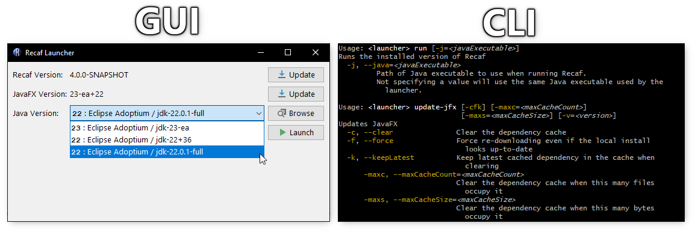

# Recaf Launcher

A simple solution for running Recaf.

## Downloading

- See the ['releases' page](https://github.com/Col-E/Recaf-Launcher/releases)

## Usage

For more details see the dedicated `README.md` for the GUI and CLI sub-modules:

- [**GUI**: Graphical user interface](gui/README.md)
- [**CLI**: Command line interface](cli/README.md)

## Additional Information

- [Why does this launcher exist?](WHY.md)
- [How do I manually run Recaf without this launcher?](MANUAL.md)