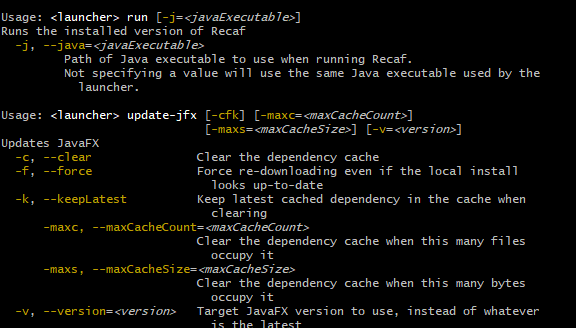

# Recaf Command-Line Launcher

A simple command-line solution for running Recaf.



## Usage

### Auto
- Checks local system compatibility
- Keeps JavaFX up-to-date
- Keeps Recaf up-to-date
- Runs Recaf
```
Usage: <launcher> auto
```

### Run
- Runs the currently installed version of Recaf
```
Usage: <launcher> run
  -j, --java=<javaExecutable>
         Path of Java executable to use when running Recaf.
         Not specifying a value will use the same Java executable used by the
           launcher.
```

### Compatibility
- Checks for a compatible version of Java
- Checks if the current Java runtime includes JavaFX
    - Bundling JavaFX _can_ work, but its your responsibility to ensure the bundled version is compatible with Recaf
    - Ideally use a JDK that does not bundle JavaFX and let the launcher pull in JavaFX
```
Usage: <launcher> compatibility [-ifx] [-ss]
      -ifx, --ignoreBundledFx
         Ignore problems with the local system's bundled JavaFX version
      -ss, --skipSuggestions
         Skip solutions to detected problems
```

### Update Recaf
- Keeps Recaf up-to-date
```
Usage: <launcher> update
```
If you want to be on the bleeding edge of things there is an alternative command:
```
Usage: <launcher> update-ci [-b=<branch>]
Installs the latest artifact from CI
  -b, --branch=<branch>   Branch name to pull from.
                          By default, no branch is used.
                          Whatever is found first on the CI will be grabbed.
```

### Update JavaFX
- Keeps Recaf's local JavaFX cache up-to-date with the current release of JavaFX
- Can be configured to use specific versions of JavaFX if desired
- Can be configured to delete old versions of JavaFX in the cache automatically
```
Usage: <launcher> update-jfx [-cfk] [-maxc=<maxCacheCount>]
                             [-maxs=<maxCacheSize>] [-v=<version>]
  -c, --clear               Clear the dependency cache
  -f, --force               Force re-downloading even if the local install
                              looks up-to-date
  -k, --keepLatest          Keep latest cached dependency in the cache when
                              clearing
      -maxc, --maxCacheCount=<maxCacheCount>
                            Clear the dependency cache when this many files
                              occupy it
      -maxs, --maxCacheSize=<maxCacheSize>
                            Clear the dependency cache when this many bytes
                              occupy it
  -v, --version=<version>   Target JavaFX version to use, instead of whatever
                              is the latest
```

### Check Recaf's version
- Prints out the version of Recaf installed via the launcher
```
Usage: <launcher> version
```